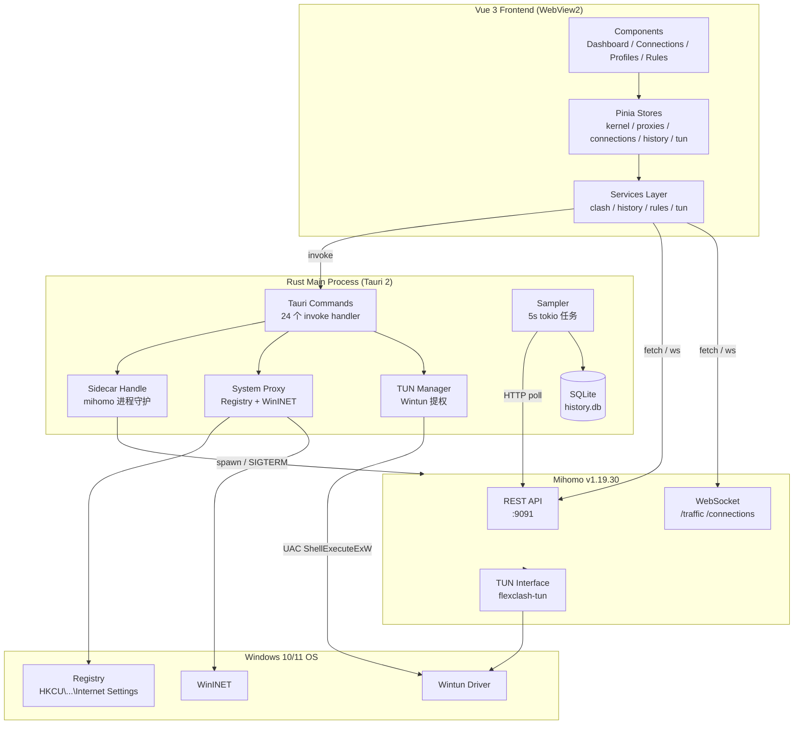
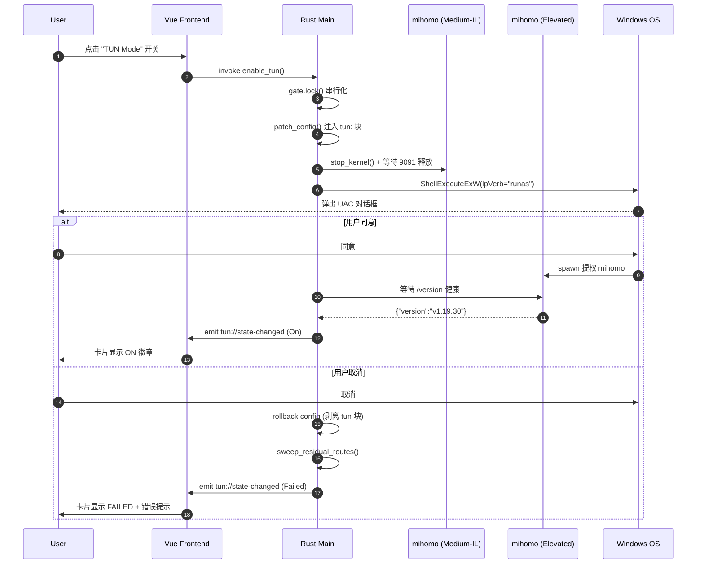

<div align="center">

# FlexClash

### 轻盈的 Mihomo 代理客户端 — 基于 Tauri 2 + Vue 3

[](https://tauri.app/)
[](https://vuejs.org/)
[](https://www.rust-lang.org/)
[](https://www.typescriptlang.org/)
[](./LICENSE)
[](#平台支持)
[]()

<strong>Web 前端打包 ~100 KB gzip · 冷启动 ~30 MB 内存 · 24 条 IPC 命令 · 0 警告 0 类型错误</strong>

[核心特性](#核心特性) · [架构拓扑](#架构拓扑) · [快速开始](#快速开始) · [构建发布](#构建发布) · [贡献](#贡献与协议)

</div>

---

## 项目定位

**FlexClash** 是一款面向 **Windows 10/11** 桌面端的 Mihomo (Clash Meta) 图形化代理客户端。

不同于 Electron 应用动辄 100 MB+ 的运行时膨胀，FlexClash 采用 **Tauri 2.0 (Rust + 系统 WebView)** 的精简架构，主进程仅 8 MB，前端打包 **82 KB gzip**。整个应用在保持高颜值 Mica 毛玻璃界面的同时，冷启动内存占用仅约 30 MB，**几乎与原生应用无异**。

### 为什么选择 FlexClash？

| 痛点 | 传统方案 | FlexClash |
|------|----------|-----------|
| 内存膨胀 | Electron 客户端 ≥ 200 MB | Tauri 主进程 ≤ 8 MB |
| 系统代理切换 | 切换瞬间断网 | 零断网原子化切换 |
| TUN 透明代理 | 配置复杂、需手敲路由 | 一键 UAC 提权、状态可回滚 |
| 流量监控 | 1 万连接卡顿 | 虚拟列表 60 fps 滚动 |
| 历史趋势 | 需导入外部工具 | 内置 SQLite + Canvas 波形图 |
| 桌面融合 | 通用灰底窗口 | Win11 原生 Mica / Acrylic |

---

## 界面预览

FlexClash 采用现代 Fluent 深色玻璃设计语言，所有面板共享一致的视觉体系（`bg-white/5` + `backdrop-blur-md`）：

| 区域 | 视觉重点 |
|------|----------|
| **顶栏** | 品牌渐变图标 · running 状态脉动点 · 药丸导航（Dashboard / Connections / Profiles / Stats）· 实时计数药丸 · 语言切换下拉 |
| **仪表盘** | 三个状态卡片（Mihomo 内核 / 控制端口 / API 探针）· 三个开关卡（系统代理 / 开机自启 / TUN）· 流量仪表板（上行 / 下行）· 代理组 + 节点卡（hover-lift · 延迟药丸分级染色）· 折叠内核日志 |
| **连接页** | 虚拟列表 · 60 fps 滚动 · 速率聚合 · 关键字/策略过滤 · 可调轮询间隔 · 断开全部确认模态 |
| **统计页** | Canvas 原生绘图（1h / 24h / 7d）· 60 / 24 / 28 个采样点零填充 · 路由规则表（类型徽章彩色 · 实时搜索 · 类型筛选） |

**双语支持** — 默认中文，可一键切换到 English；选择持久化到 localStorage，刷新后保留。翻译表覆盖 8 个命名空间（common / nav / time / dashboard / proxies / connections / profiles / stats）+ 状态徽章（running / starting / stopped / crashed / unknown）。详见 `src/i18n.ts` 与 `src/locales/`。

## 核心特性

### 🎨 桌面深度融合
- **Windows 11 Mica / Win10 Acrylic** 毛玻璃原生背景（`window-vibrancy 0.5`）
- **现代 Fluent 深色玻璃** UI（`bg-white/5` + `backdrop-blur-md`，胶囊药丸导航，pulsing 状态灯）
- **双语界面** 简体中文（默认）+ English，实时切换，本地持久化
- **开机自启** 通过注册表 `HKCU\...\Run` 注入，附带 `--silent` 静默启动
- **系统托盘常驻** 单击切换主窗口可见性，右键菜单控制核心启停
- **单实例锁** 防止多开冲突（`tauri-plugin-single-instance` 等价实现）

### 🛡️ 双模式接管

#### 1. 系统代理模式（默认）
- **WinINET 32/64 位双写**，覆盖所有 Windows 应用（UWP / Win32 / 控制台）
- 注册表原子切换，**切换瞬间零断网**
- 关闭代理时自动还原 `direct` 配置

#### 2. TUN 透明代理模式
- **Wintun 内核驱动** 创建 `flexclash-tun` 虚拟网卡
- **Plan C 状态机** 提权流程：
  ```
  Off ──► Enabling ──► On ──► Disabling ──► Off
                  │                 ▲
                  ▼                 │
               Failed ◄──── UAC 取消
  ```
- **ShellExecuteExW + lpVerb="runas"** 触发 UAC 提权 mihomo
- **TUN 取消时自动回滚** 配置文件 `tun:` 块并 sweep 残留路由

### ⚡ 高频数据零主线程负担
- **WebSocket 直连** mihomo `/traffic` 流，前端独立管理背压
- **虚拟列表渲染** 1 万+ 活跃连接时仍保持 60 fps（`@tanstack/vue-virtual`）
- **Rust 端不代理 REST 请求** 前端直连 `127.0.0.1:9091`，避免 IPC 序列化开销

### 💾 本地轻量持久化
- **SQLite (rusqlite 0.31, bundled)** 流量历史，无需安装数据库服务
- **预聚合查询** 1h / 24h / 7d 三档时间窗口，零填充算法保证曲线连续
- **30 天滚动保留** 自动清理过期样本
- **原生 Canvas 渲染** DPR-aware 波形图，**不引入任何图表库**（节省 ~80 KB gzip）

### 🔁 进程守护
- **Sidecar 模式** 托管 mihomo 子进程，崩溃自动重启 + 抖动退避
- **优雅停止** `SIGTERM` + 端口回收确认，避免 9091 占用泄漏
- **启动自愈** `sweep_residual_routes()` 清理上次异常退出残留的 Wintun 适配器

---

## 架构拓扑

### 整体数据流



### TUN 提权时序（Plan C 状态机）



---

## 技术栈

### 前端 (82 KB JS gzip · 5.6 KB CSS gzip)

| 库 | 版本 | 用途 |
|----|------|------|
| Vue | 3.5 | 组合式 API + `<script setup>` |
| Vite | 5.4 | 极速 HMR + Rollup 打包 |
| TypeScript | 5.6 | 严格模式（vue-tsc 0 错误） |
| Pinia | 2.3 | 状态管理（9 个 store） |
| Tailwind | 3.4 | 原子化样式 |
| Lucide Icons | 0.469 | 矢量图标 |
| @tanstack/vue-virtual | 3.10 | 虚拟列表 |
| @vueuse/core | 12.0 | 响应式工具集 |
| axios | 1.7 | HTTP 客户端 |

### 后端 (8 MB 编译后二进制)

| Crate | 版本 | 用途 |
|-------|------|------|
| tauri | 2.x | 主进程 + IPC + 系统集成 |
| tauri-plugin-* | 2.x | shell / fs / http / process / dialog / autostart |
| window-vibrancy | 0.5 | Win11 Mica / Win10 Acrylic |
| rusqlite | 0.31 (bundled) | SQLite 流量历史 |
| reqwest | 0.12 (rustls) | mihomo API 轮询 |
| tokio | 1.x | 异步运行时（sampler / 路由清理） |
| serde / serde_json | 1 | IPC 序列化 |
| serde_yaml | 0.9 | Mihomo 配置解析 |
| winreg | 0.52 | Windows 注册表系统代理 |
| windows | 0.58 | Win32 API (WinINet / ShellAPI) |

### 运行时依赖

| 组件 | 版本 | 说明 |
|------|------|------|
| Mihomo | v1.19.30 | sidecar，47.81 MB，下载自 [MetaCubeX/mihomo](https://github.com/MetaCubeX/mihomo/releases) |
| Wintun | 0.14+ | TUN 模式所需驱动，Windows 自动通过 `tauri-driver` 安装 |

---

## 快速开始

### 系统要求

- **操作系统**: Windows 10 1809+ / Windows 11（推荐 Mica 背景）
- **运行时**: 无需单独安装 Node / Rust（开发时需要）
- **管理员权限**: TUN 模式首次启动会触发 UAC 弹窗
- **磁盘空间**: 约 120 MB（含 mihomo sidecar）

### 开发模式

```powershell
# 1. 克隆仓库
git clone https://github.com/yourname/flexclash.git
cd flexclash

# 2. 安装前端依赖
npm install

# 3. 准备 mihomo sidecar（FlexClash 不提交二进制，需用户自备）
#    从 https://github.com/MetaCubeX/mihomo/releases 下载 v1.19.30
#    重命名为 mihomo-x86_64-pc-windows-msvc.exe
#    放入 src-tauri/binaries/ 目录

# 4. 启动开发模式（Vite HMR + Tauri 热重载）
npm run tauri:dev
```

### 端到端验证

FlexClash 采用分层测试策略（详见 [CONTRIBUTING.md](./CONTRIBUTING.md)）：

```powershell
# Layer 1: Rust 单测 (21 项) + 集成测试
cd src-tauri
cargo test

# Layer 2 + 3: TypeScript 类型检查 + Vite 打包
cd ..
npm run build

# Layer 4 (可选): Tauri 生产构建 (~8-10min)
npm run tauri:build
```

---

## 构建发布

### 生产构建

```powershell
npm run tauri:build
```

构建产物（已实测）：

| 文件 | 大小 | SHA-256 |
|------|------|---------|
| `src-tauri\target\release\flexclash.exe` | 8.07 MB | `60A76407…01AA89B` |
| `src-tauri\target\release\bundle\nsis\FlexClash_0.1.0_x64-setup.exe` | 15.59 MB | `2C123FFC…4E655F0` |
| `src-tauri\target\release\bundle\msi\FlexClash_0.1.0_x64_en-US.msi` | 21.70 MB | `57F8C140…2E541CF7` |

> 💡 **NSIS 安装包比 MSI 小 ~30%**：NSIS 压缩比更优。如需企业批量部署（域控 GPO），推荐 MSI。

### 应用签名（生产环境建议）

未签名的 `.exe` 在 Win11 上会触发 SmartScreen 警告。生产发布前请配置代码签名证书：

```powershell
# 设置环境变量
$env:TAURI_SIGNING_PRIVATE_KEY = "..."
$env:TAURI_SIGNING_PRIVATE_KEY_PASSWORD = "..."

# 重新构建
npm run tauri:build
```

详见 [Tauri Code Signing 文档](https://tauri.app/distribute/sign/)。

---

## 平台支持

| 平台 | 状态 | 备注 |
|------|------|------|
| Windows 11 | ✅ 完整支持 | Mica 背景 + Wintun |
| Windows 10 (1809+) | ✅ 完整支持 | Acrylic 背景 + Wintun |
| macOS 13+ | 🚧 占位 stub | `core/sidecar.rs` Unix 分支预留 |
| Linux (systemd) | 🚧 占位 stub | TUN 需 root + nftables |

Phase 1 与 Phase 2 已在 Windows 上高分闭环（21 个 Rust 单测 + 30 个 verify-m 端到端测试全绿）。Linux/macOS 的 `#[cfg(unix)]` 分支已就位，待社区贡献。

---

## 项目结构

```
flexclash/
├── src/                          # Vue 3 前端
│   ├── components/               # 13 个 .vue 组件
│   ├── stores/                   # 9 个 Pinia store
│   ├── services/                 # 8 个 Tauri 包装层
│   ├── composables/              # useTrafficStream / useConnectionMonitor
│   ├── types/                    # clash.d.ts (Mihomo API 类型)
│   ├── utils/                    # format.ts (字节/时间格式化)
│   └── App.vue                   # 4 标签主界面
│
├── src-tauri/                    # Rust 后端
│   ├── src/
│   │   ├── commands/             # 8 个 IPC 模块
│   │   │   ├── kernel.rs         # mihomo 启停
│   │   │   ├── proxy.rs          # 系统代理
│   │   │   ├── profile.rs        # 配置文件 CRUD
│   │   │   ├── desktop.rs        # 自启 / 静默 / sweep
│   │   │   ├── tun.rs            # TUN 模式
│   │   │   ├── history.rs        # 流量历史
│   │   │   └── ...
│   │   ├── core/                 # 业务核心
│   │   │   ├── sidecar.rs        # mihomo 进程守护
│   │   │   ├── startup.rs        # 启动自愈 + Mica
│   │   │   ├── shutdown.rs       # 单实例锁 + 退出清理
│   │   │   ├── elevate.rs        # UAC 提权
│   │   │   ├── tun.rs            # TUN 状态机
│   │   │   └── route_guard.rs    # 残留路由清理
│   │   ├── store/                # SQLite 历史
│   │   │   ├── migrations.rs     # schema + 30 天 prune
│   │   │   ├── queries.rs        # 预聚合 + 零填充
│   │   │   └── sampler.rs        # 5s 采样循环
│   │   ├── proxy/                # 系统代理实现
│   │   │   ├── windows.rs        # 注册表 + WinINET
│   │   │   └── unix.rs           # macOS/Linux stub
│   │   ├── config/               # Mihomo YAML
│   │   ├── events.rs             # Tauri 事件常量
│   │   ├── tray.rs               # 系统托盘
│   │   ├── error.rs              # AppError 枚举
│   │   └── lib.rs                # Tauri Builder
│   ├── tests/                    # 3 个集成测试
│   ├── resources/
│   │   └── default_mihomo.yaml   # 首次启动默认配置
│   ├── binaries/
│   │   ├── .gitkeep
│   │   └── mihomo-x86_64-pc-windows-msvc.exe  # 用户自备
│   ├── capabilities/default.json
│   ├── icons/                    # 多尺寸 PNG / ICO
│   ├── build.rs
│   ├── Cargo.toml
│   ├── Cargo.lock                # 已提交 (Tauri binary crate 可复现构建)
│   └── tauri.conf.json
│
├── CONTRIBUTING.md                 # 贡献指南 + 测试策略
├── package.json                  # 前端依赖
├── vite.config.ts
├── tailwind.config.js
├── tsconfig.json
├── index.html
├── .gitignore
├── LICENSE                       # MIT
└── README.md                     # 你正在读的
```

---

## 里程碑进度

| 阶段 | 里程碑 | 内容 | 状态 |
|------|--------|------|------|
| **Phase 1** | M1 | mihomo sidecar 进程生命周期 | ✅ 10/10 |
| | M2 | 系统代理接管（注册表 + WinINET） | ✅ 7/7 |
| | M3 | 实时流量 / WebSocket 订阅 | ✅ 7/7 |
| | M4 | 订阅 URL + 配置文件管理 | ✅ 8/8 |
| | M5 | 节点选择 / 代理组 | ✅ 7/7 |
| | M6 | Mica 背景 + 自启 + 静默 + 托盘 | ✅ 7/7 |
| **Phase 2** | M7 | 启动自愈 + 路由清理 | ✅ 7/7 |
| | M8 | 连接虚拟列表（10k+ 60fps） | ✅ 7/7 |
| | M9 | TUN 模式 + UAC 提权 + Wintun | ✅ 10/10 |
| | M10 | SQLite 流量历史 + 规则视图 | ✅ 10/10 |

**累计**: 21 个 Rust 单测 + 30 个端到端 verify 全部通过。前端 bundle 增量全程 **< 5 KB gzip / 里程碑**（预算 +10 KB）。

---

## 贡献与协议

### 提交流程

1. Fork 本仓库
2. 创建特性分支 (`git checkout -b feat/your-feature`)
3. 提交 (`git commit -m 'feat: add amazing feature'`)
4. 推送 (`git push origin feat/your-feature`)
5. 发起 Pull Request

### 提交规范

遵循 [Conventional Commits](https://www.conventionalcommits.org/zh-hans/)：

```
feat: 新功能
fix:  修复
docs: 文档
refactor: 重构（不新增功能、不修 bug）
test: 增加/修改测试
chore: 杂项（构建、CI、依赖）
```

### 开发守则

- **Rust**: 严格 `clippy::all` 0 warning；Mutex 持锁绝不跨 `.await`
- **TypeScript**: `vue-tsc --noEmit` 0 错误；优先 `type` 而非 `interface` 用于并集
- **测试先行**: 改动核心路径前先扩充 `verify-m*.ps1` 用例
- **小步提交**: 单个 PR ≤ 500 行 diff，便于审查

### 协议

本项目基于 **MIT License** 开源 — 详见 [LICENSE](./LICENSE) 文件。

```
MIT License  Copyright (c) 2026 FlexClash Contributors
```

### 致谢

- [Mihomo](https://github.com/MetaCubeX/mihomo) — Clash Meta 核心代理引擎
- [Tauri](https://tauri.app/) — 革命性的 Rust 桌面框架
- [Wintun](https://www.wintun.net/) — 高性能 Windows TUN 驱动
- [Vue 3](https://vuejs.org/) + [Vite](https://vitejs.dev/) + [Pinia](https://pinia.vuejs.org/) — 现代化的前端工具链

---

<div align="center">

如果 FlexClash 让你的网络生活更便利，欢迎给一个 ⭐️ ！

**Made with 🦀 Rust + 💚 Vue 3 in Windows**

</div>
