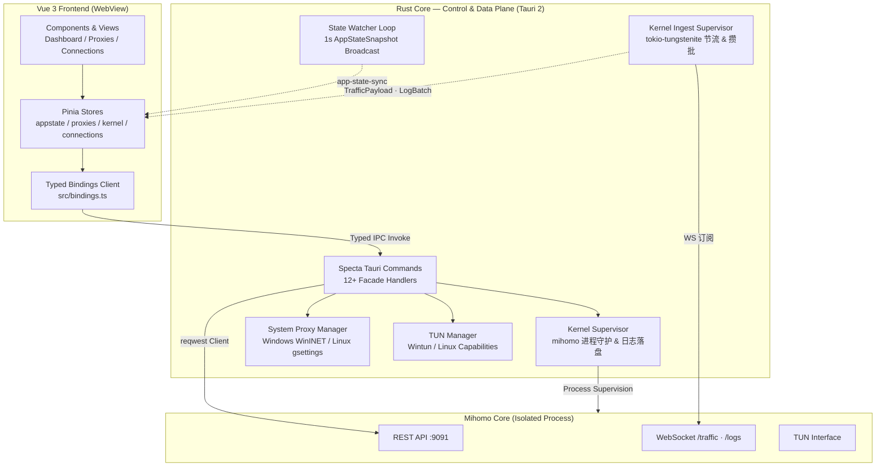

<div align="center">

# FlexClash

### 轻盈的 Mihomo 代理客户端 — 基于 Tauri 2 + Vue 3

[](https://tauri.app/)
[](https://vuejs.org/)
[](https://www.rust-lang.org/)
[](https://www.typescriptlang.org/)
[](https://github.com/oscartbeaumont/specta)
[](https://github.com/zhuyikai2002/flexclash/actions/workflows/ci.yml)
[](https://github.com/zhuyikai2002/flexclash/releases)
[](./LICENSE)
[](#平台支持)
[](https://github.com/zhuyikai2002/flexclash/releases)

<strong>Web 前端打包 ~100 KB gzip · 待机 CPU 趋近 0% · 编译期类型强契约 · 0 警告 0 类型错误</strong>

[核心特性](#核心特性) · [架构拓扑](#架构拓扑) · [快速开始](#快速开始) · [构建发布](#构建发布) · [贡献与协议](#贡献与协议)

</div>

---

## 项目定位

**FlexClash** 是一款面向 **Windows 10/11 与 Linux** 桌面端的高性能、现代化 Mihomo (Clash Meta) 图形代理客户端。

不同于传统 Electron 客户端动辄 200 MB+ 的内存占用与后台高频轮询消耗，FlexClash 基于 **Tauri 2.0 (Rust + 系统 WebView)** 架构，主进程仅 8 MB，安装包仅约 15.8 MB。前端不仅拥有精致的深色 Fluent / Mica 玻璃质感，更实现了 **Rust 统一门面（控制面 + 数据面）+ Specta 端到端类型契约 + 后台单向状态快照广播**——内核的 REST 请求与 WebSocket 推送流均不出 Rust，使应用在后台驻留时的 CPU 占用与内存开销降至冰点。

### 为什么选择 FlexClash？

| 痛点 | 传统方案 | FlexClash (v0.6.3) |
|------|----------|-------------------|
| 资源常驻 | Electron 内存 ≥ 300 MB，后台易 OOM | Tauri 架构，待机内存低，CPU 趋近 0.0% |
| 系统代理 | 单一系统绑定，切换易断网 | WinINET / GNOME gsettings 双平台原子切换 |
| 通信与稳定性 | 前端散落 fetch 轮询，接口变动易白屏 | Rust 门面兜底 + Specta 编译期绝对类型安全 |
| 状态同步 | 前台高频轮询，状态时序错乱横跳 | Rust 后台 1s 下发 `AppStateSnapshot`，内核推送流节流后类型化事件直达 |
| 流式数据 | 渲染进程自建 WebSocket，重连与积压全靠前端 | Rust 独占 `/traffic`・`/logs`，合并/攒批 + 退避重连，前端零 socket |
| TUN 透明代理 | 配置复杂、需手敲路由 | Windows Wintun + UAC / Linux 细粒度 Capabilities，双内核严格串行调度 |
| 视觉体验 | 通用灰底或生硬网页感 | Windows 11 原生 Mica / Linux 深色极简 Fluent 玻璃 |

---

## 界面预览

FlexClash 采用现代深色 Fluent 玻璃设计语言，所有面板共享自研 `--glass-*` 暗色毛玻璃设计令牌（12–20px 高斯模糊 + 饱和度增强，深色/浅色双套）：

| 区域 | 视觉重点 |
|------|----------|
| **顶栏** | 品牌渐变图标 · Running 状态脉动点 · 胶囊导航（Dashboard / Proxies / Connections / Profiles / Stats）· 实时计数与模式切换 |
| **仪表盘** | 三状态卡片（内核状态 / 控制端口 / API 连通性）· 三开关卡（系统代理 / 开机自启 / TUN）· 实时流量（上下行速率）· 折叠内核日志 |
| **策略组** | 策略组与底层节点树级展示 · 节点延迟药丸染色 · 切换防抖与乐观状态同步 · 配置保护机制 |
| **连接页** | 虚拟列表 · 60 fps 滚动 · 速率聚合 · 关键字/策略过滤 · 断开连接模态 |
| **统计页** | 原生 Canvas DPR-aware 波形图（1h / 24h / 7d）· 零第三方重型图表库依赖 |

---

## 核心特性

### 🎨 现代桌面融合
- **Windows 11 Mica / Win10 Acrylic** 毛玻璃原生背景（`window-vibrancy`）
- **自研 `--glass-*` 暗色毛玻璃设计令牌**：12–20px 高斯模糊 + 饱和度增强，深色/浅色令牌双套；长列表节点行（`.glass-row`）不叠加独立 blur，兼顾对比度与渲染性能
- **双语界面**：简体中文 + English 实时切换，选择持久化
- **单实例唤醒**：Single Instance 强制单进程，重复启动自动聚焦既有窗口；桌面项 `StartupNotify=false` 彻底消除窗口二次呼出时的鼠标转圈等待
- **无感自愈**：内核异常退出诊断、持久化 `runtime.log` 记录与用户自定义配置防冲刷保护

### 🛡️ 双模式与跨平台接管
- **Windows 平台**：WinINET 32/64 位注册表双写，覆盖 UWP / Win32 / 控制台应用
- **Linux 平台**：原生对接 GNOME `gsettings` 代理控制协议，避免侵入性改动
- **生产级 TUN 虚拟网卡接管**：
  - Linux：基于 Capabilities（`cap_net_admin,cap_net_bind_service=+ep`）细粒度赋权，告别整机 `sudo` 启动风险；自动处理策略路由（`ip rule` + `auto-route`/`auto-redirect`）与 fake-ip DNS
  - Windows：原生集成 Wintun 驱动与 UAC 提权，NSIS 安装器预清理僵尸 sidecar
- **双内核生命周期调度**：常规 Sidecar 与提权 TUN 内核严格串行——TUN 期间任何 `sidecar::start` 都被统一守卫（`owns_ports`）在命令层 / supervisor / 进程拉起最深处三重拒绝；进程句柄经 `Child::wait()` 回收，杜绝 Linux `<defunct>` 僵尸进程与 9091/7897 端口抢占
- **默认端口独立**：采用混合代理端口 `7897`、REST 控制端口 `9091`，避免与常见客户端默认端口（7890/9090）产生冲突

### ⚡ 工业级坚固架构
- **Rust 统一门面（控制面 + 数据面）**：前端零直连——REST 指令与内核 `/traffic`、`/logs` WebSocket 推送流全部收口至 Rust 层
- **Specta 强类型契约**：Rust 结构体与事件自动生成 `src/bindings.ts`，命令参数与事件载荷双双编译期校验，杜绝运行时未定义与空指针崩溃
- **单向推模式状态流**：Rust 每秒广播 `AppStateSnapshot`（内核健康 / 系统代理 / 出站模式），实时速率则由内核 `/traffic` 流合并后推送，前端彻底告别 `setInterval` 与自建 WebSocket
- **内建流式 QoS**：traffic 最新值合并（1s 仅推 1 次）、logs 有界批量打包（500ms / 4096 行上限），订阅永久挂起不丢连接、不涨内存

### 🔄 运维与健壮性
- **应用内自动更新**：集成 tauri-plugin-updater，一键检查版本、显示 Release Notes、静默下载与自动重启安装（启用自签名更新通道）
- **TUN 无感静默提权**：`ShellExecuteExW`(SW_HIDE) + 全子进程 `CREATE_NO_WINDOW`，彻底消除 CMD 黑框闪烁
- **配置防冲刷保护**：用户订阅配置永不被冷启动默认值覆盖，节点完整留存
- **崩溃取证落盘**：`runtime.log` 持久化 + sidecar 退出码追踪，长期挂机可诊断

---

## 架构拓扑



> 注：Rust 独占内核数据面。`/traffic` 与 `/logs` 的 WebSocket 由 `core::ingest` 单一监督任务读取，**节流**（traffic 每 1s 仅保留最新瞬时值，丢弃中间帧）与**攒批**（logs 每 500ms 打包一次，有界 4096 行）后，经 `TrafficPayload` / `LogBatch` 类型化事件推入前端；内核重启或断连时按 500ms → 10s 指数退避自动重连，内核停止即 `abort` 孤儿任务。渲染进程已不再打开任何原生 `WebSocket`。

> 双内核生命周期：TUN 开启期间（`Enabling | On`）所有拉起常规 Sidecar 的企图被统一守卫（`owns_ports`）拒绝，提权内核句柄经 `Child::wait()` 回收，杜绝 `<defunct>` 僵尸与 9091/7897 端口抢占。

---

## 技术栈

### 前端库

| 库 | 版本 | 用途 |
|----|------|------|
| Vue | 3.5 | 组合式 API + `<script setup>` |
| Vite | 5.4 | 极速构建与 HMR |
| TypeScript | 5.6 | 严格模式编译校验 |
| Pinia | 2.3 | 单向状态存储与快照投影 |
| Tailwind CSS | 3.4 | 原子化设计系统 |
| @tanstack/vue-virtual | 3.10 | 活跃连接虚拟列表（60 fps） |
| @tauri-apps/api | 2.x | 原生窗口与 IPC 通信 |

### 后端 (Rust)

| Crate | 版本 | 用途 |
|-------|------|------|
| tauri | 2.x | 主进程框架与跨平台抽象 |
| specta / tauri-specta | 2.0.0-rc | 编译期 TypeScript 类型契约自动生成 |
| reqwest | 0.12 (rustls) | Mihomo 控制面统一请求与超时保护 |
| tokio | 1.x | 异步任务调度、状态广播心跳与数据面节流 tick |
| tokio-tungstenite | 0.26 | 内核 `/traffic`・`/logs` WebSocket 数据面接管 |
| rusqlite | 0.31 | 本地流量历史持久化 |
| winreg / windows | 0.52 / 0.58 | Windows 注册表与提权控制 |

---

## 平台支持

| 平台 | 状态 | 系统代理方案 | 备注 |
|------|------|--------------|------|
| Windows 11 | ✅ 完整支持 | WinINET / 注册表原子操作 | 支持原生 Mica 背景 + Wintun |
| Windows 10 | ✅ 完整支持 | WinINET / 注册表原子操作 | 支持 Acrylic 背景 + Wintun |
| Linux (GNOME / WSL2 / Arch) | ✅ 完整支持 | gsettings 原生控制 | 平台条件编译，0 Error 构建；Arch/EndeavourOS 提供 PKGBUILD 一键安装 |
| macOS | 🚧 架构就绪 | networksetup (Stub) | 核心 Unix 通路已留存，待实机验证 |

---

## 快速开始

### 运行环境

- Node.js >= 20（LTS，CI 实测）
- Rust >= 1.78（stable）
- **Linux 构建依赖**：`libwebkit2gtk-4.1-dev`、`libappindicator3-dev`、`librsvg2-dev`、`patchelf`、`libssl-dev`（Arch 系：`webkit2gtk-4.1`、`libappindicator-gtk3`、`librsvg`、`openssl`）
- **Mihomo Core**：将对应平台的二进制放置于 `src-tauri/binaries/`（`bundle.externalBin` 依此命名解析，缺失会导致构建失败）：
  - Windows: `mihomo-x86_64-pc-windows-msvc.exe`
  - Linux: `mihomo-x86_64-unknown-linux-gnu`（需 `chmod +x`）

### 本地开发

```bash
# 1. 安装依赖
npm install

# 2. 启动开发模式（前端 Vite + 后端 Tauri 热重载）
npm run tauri dev
```

### 代码检查

```bash
# 前端类型检查
npx vue-tsc --noEmit

# 后端编译检查
cd src-tauri && cargo check
```

---

## 下载与安装

### GitHub Actions 多平台产物（v0.6.3）

推送 `v*` tag 自动触发 `.github/workflows/release.yml` 矩阵构建，经 `tauri-action` 自动发布到 [Releases](https://github.com/zhuyikai2002/flexclash/releases)：

| 平台 | 产物 |
|------|------|
| Windows | `FlexClash_<ver>_x64-setup.exe`（NSIS 安装包）、`FlexClash_<ver>_x64_en-US.msi` |
| Linux | `FlexClash_<ver>_amd64.deb`、`FlexClash_<ver>_amd64.AppImage` |

### Arch / EndeavourOS 一键安装

```bash
git clone https://github.com/zhuyikai2002/flexclash.git
cd flexclash/packaging/arch
makepkg -si
```

`packaging/arch/PKGBUILD`（`flexclash-bin`）会从 GitHub Release 下载并解包 `.deb` 载荷（二进制落位于 `/usr/bin/flexclash`，内核 `/usr/bin/mihomo`）；`flexclash.install` 的 `post_install` / `post_upgrade` 已内置 `setcap cap_net_admin,cap_net_bind_service=+ep /usr/bin/mihomo`，**安装即享免密码启用 TUN**。桌面项统一为小写 `flexclash.desktop`（`StartupNotify=false`），不会出现重复启动项。

---

## 构建发布

```bash
# 全量生产打包（Linux: deb / rpm / AppImage；Windows: NSIS / MSI）
npm run tauri build
```

### 产物参考 (v0.6.3)

- Windows NSIS 安装包：`src-tauri/target/release/bundle/nsis/FlexClash_0.6.3_x64-setup.exe`
- Windows MSI 企业包：`src-tauri/target/release/bundle/msi/FlexClash_0.6.3_x64_en-US.msi`
- Linux Debian 包：`src-tauri/target/release/bundle/deb/FlexClash_0.6.3_amd64.deb`
- Linux AppImage：`src-tauri/target/release/bundle/appimage/FlexClash_0.6.3_amd64.AppImage`

> CI 门禁（`.github/workflows/ci.yml`，push/PR）：`cargo fmt`、`clippy -D warnings`、Rust 单测、bindings 漂移检查、`vue-tsc`。发布（`.github/workflows/release.yml`，`v*` tag）：Ubuntu-22.04 / Windows-latest 矩阵 + `tauri-action` 自动打包上传，含更新器 `latest.json`；Mihomo sidecar 由 `fetch-mihomo` composite action 按平台下载并做 sha256 校验。

---

## 贡献与协议

本项目基于 **MIT License** 开源。

- [Mihomo (MetaCubeX)](https://github.com/MetaCubeX/mihomo) — 强大的核心网络代理引擎
- [Tauri](https://tauri.app/) — 轻量级、高安全性的跨平台应用框架
- [Specta](https://github.com/oscartbeaumont/specta) — 优雅的 Rust-to-TypeScript 类型桥梁

Made with 🦀 Rust + 💚 Vue 3
